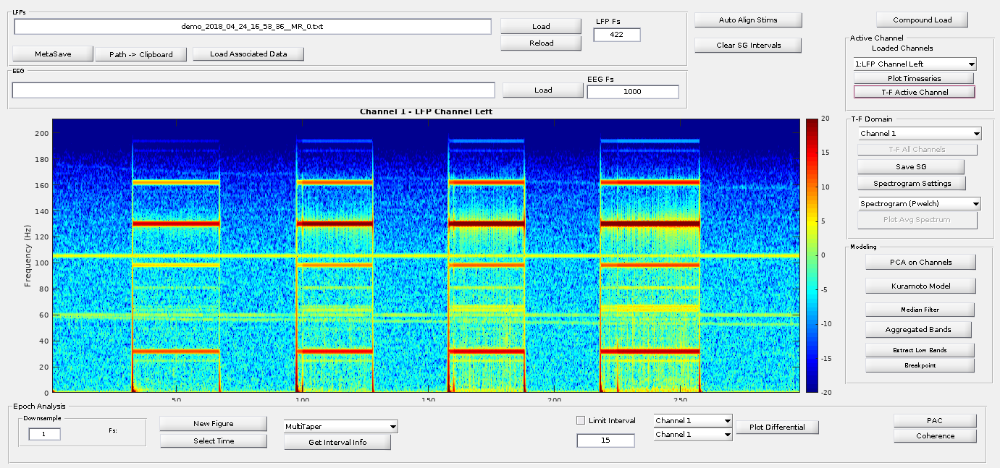
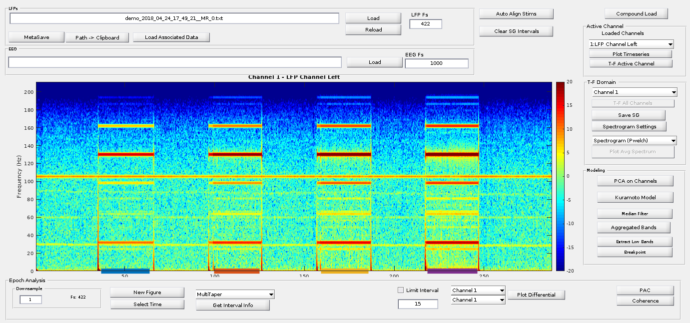
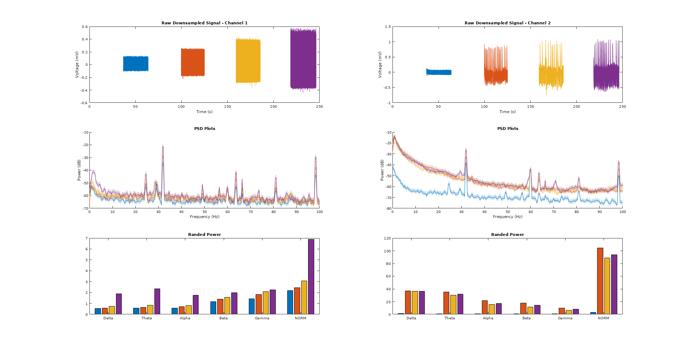

# Spectrogram Viewer
A MATLAB based spectrogram viewer that imports generic timeseries data. Beyond time-frequency displays and interactive interval-based PSD estimation, this tool does some basic gain compression assessment

## Installation
The folder is self-contained and includes related libraries.

### Dependencies
* [Filtfilthd]()
* [Boundedline]() 

## Frontend
The frontend is focused on time-frequency domain displays of data. UI is available for more advanced functionality. The primary functionality of interest for contemporary (2013-2018) clinical electrophysiology is likely

## Disclaimer
The viewer is provided *as is* and without guarantees or liability.

## Features

### Spectrogram Viewing
The primary feature of the tool is to view Spectrograms, which are time-frequency domain representations of timeseries. The default parameters give nice and pretty SGs. These parameters cant be adjusted in UI -> SG -> BUTTON!

### Rapid PSD and Oscillatory power calculations
One feature of the SG is to be able to compute the PSD of an interactively selectable interval in the active SG.

The four intervals selected can be seen by the color bars at the bottom of the main window's SG.

The PSDs pop up in a separate window

Each of the colors corresponds to the different intervals selected in the frontend. Intervals can be added dynamically to this view without having to restart the selection process. However, if a new window is desired, then it can be generated in the frontend viewer.

### Gain Compression Assessment
Gain compression is a problem that occurs when amplifiers are overwhelmed by input signals that are too large for their design. Clinical recordings can suffer from gain compression, especially when stimulation or other asymmetric artifacts are present. More informtaion can be found in this paper: PAPERLINK

The SGViewer incorporates simple gain compression measures that may assist in determining whether a recording is suffering from GC.

## Notes
My original goal for this was overly-ambitious. I wanted it to include everything analysis-wise that existed in 2013 to address frequency-domain electrophysiology. It took a while but I realized that the field of electrophysiology was nowhere near the level that neuroimaging was and there really was no way to do a simple frontend for electrophysiology analysis. There are simply way too many knobs. You can see this attempt in my earlier commits.

